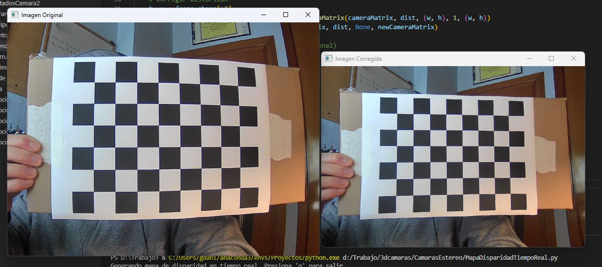

# **CalibracionWebCam**

Este repositorio muestra cómo realizar la calibración de una cámara web utilizando Python y OpenCV. La calibración es útil para corregir distorsiones en las imágenes y mejorar la precisión en aplicaciones de visión por computadora.

---

## **Ejemplo de resultados**

A continuación, se muestra un ejemplo del resultado de la corrección de distorsión. La imagen original se encuentra a la izquierda y la imagen corregida a la derecha:



---

## **Descripción general**

El proyecto incluye tres scripts principales que trabajan juntos para capturar imágenes, calibrar una cámara y aplicar la corrección de distorsión en tiempo real.

1. **`tomarimagenesAjedrez.py`**:
   - Captura imágenes de un patrón de ajedrez desde la cámara.
   - Permite guardar imágenes con una tecla para usarlas en la calibración.

2. **`CalibrarCamara.py`**:
   - Utiliza las imágenes capturadas para calcular los parámetros de calibración de la cámara, como la matriz intrínseca y los coeficientes de distorsión.
   - Genera archivos de salida que contienen estos parámetros para su uso posterior.

3. **`inferenciaCorreccionDistorsion.py`**:
   - Corrige la distorsión en imágenes capturadas en tiempo real utilizando los parámetros de calibración generados previamente.

---

## **Requisitos**

Para ejecutar los scripts, necesitas lo siguiente:

- **Python 3.7+**
- **OpenCV 4.0+**
- **Patrón de ajedrez físico**: Un tablero con cuadros de tamaño conocido.
- **Cámara web**: Compatible con OpenCV.

---

## **Cómo usar este proyecto**

### **Paso 1: Captura de imágenes**
Ejecuta el script `tomarimagenesAjedrez.py`:
- Coloca el patrón de ajedrez frente a la cámara.
- Presiona la tecla `s` para guardar cada imagen.
- Asegúrate de capturar al menos 10-20 imágenes desde diferentes ángulos.

Las imágenes se guardarán en la carpeta `D:/Trabajo/3dcamaras/Imagenes_cal/camara1`.

---

### **Paso 2: Calibración de la cámara**
Ejecuta el script `CalibrarCamara.py`:
- El script detectará automáticamente el patrón de ajedrez en las imágenes capturadas.
- Calcula los parámetros de calibración y los guarda en la carpeta `D:/Trabajo/3dcamaras/ResultadosCamara1`.

---

### **Paso 3: Corrección en tiempo real**
Ejecuta el script `inferenciaCorreccionDistorsion.py`:
- Utiliza los parámetros generados para corregir la distorsión en imágenes capturadas en tiempo real.
- Muestra tanto la imagen original como la corregida en ventanas separadas.

---

## **Aplicaciones de la calibración de cámaras**
- Corrección de distorsiones en imágenes.
- Visión estéreo y reconstrucción 3D.
- Realidad aumentada.
- Seguimiento de objetos con mayor precisión.

---

## **Posibles mejoras**
- Extender el proyecto para soportar la calibración de múltiples cámaras.
- Implementar visión estéreo para calcular mapas de disparidad.
- Mejorar la interfaz para simplificar el uso de los scripts.

---

## **Licencia**
Este proyecto está disponible bajo la licencia MIT. ¡Siéntete libre de usarlo y contribuir con mejoras!

---

## **Estructura del repositorio**

```plaintext
CalibracionWebCam/
│
├── tomarimagenesAjedrez.py   # Script para capturar imágenes del patrón de ajedrez.
├── CalibrarCamara.py         # Script para calibrar la cámara.
├── inferenciaCorreccionDistorsion.py   # Script para corregir distorsión en tiempo real.
├── Imagenes_cal/             # Carpeta para almacenar imágenes capturadas.
│   └── camara1/              # Imágenes del patrón de ajedrez.
├── ResultadosCamara1/        # Parámetros de calibración generados.
│   ├── cameraMatrix.pkl      # Matriz intrínseca.
│   ├── dist.pkl              # Coeficientes de distorsión.
│   └── undistorted_image.png # Imagen corregida.
└── muestras/                 # Carpeta con imágenes de ejemplo.
    └── muestra.png
